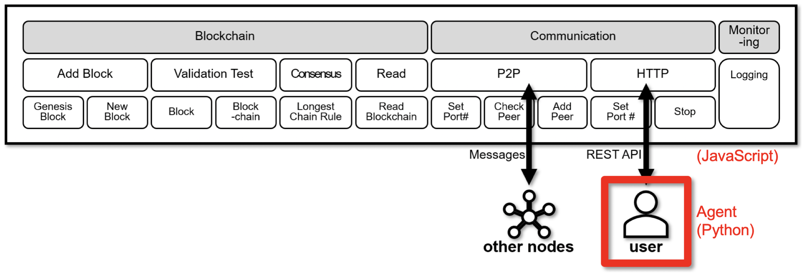

# Voting Simulator   

블록체인은 이상적인 거버넌스 실험장이나, 네트워크 구성원의 참여를 유도할 수 없어 유효성과 확장성에 한계가 있다.

이에 본 연구에서는 네트워크 구성원을 지능형 에이전트로 대체한 블록체인 기반 거버넌스 시뮬레이터를 제안한다. 규칙 기반의 에이전트를 통해 제곱투표의 사례를 보이고, 에이전트 하나에 대한 최적해를 도출한다.

그 결과 제곱투표는 구성원의 최대 다수의 최대 이익을 달성함을 보인다. 또한, 매수를 통해 적은 수의 투표권으로 많은 투표수를 행사하는 공격 사례를 보인다.

# System Overview

제곱투표를 지원하는 블록체인은 자바스크립트(JavaScript)로 구현된 [원체인(onechain)](https://github.com/lukepark327/onechain)을 이용한다. 각 에이전트는 파이썬(Python)으로 구현하며 블록체인과 HTTP 인터페이스를 통해 소통한다.

# Demo

   
